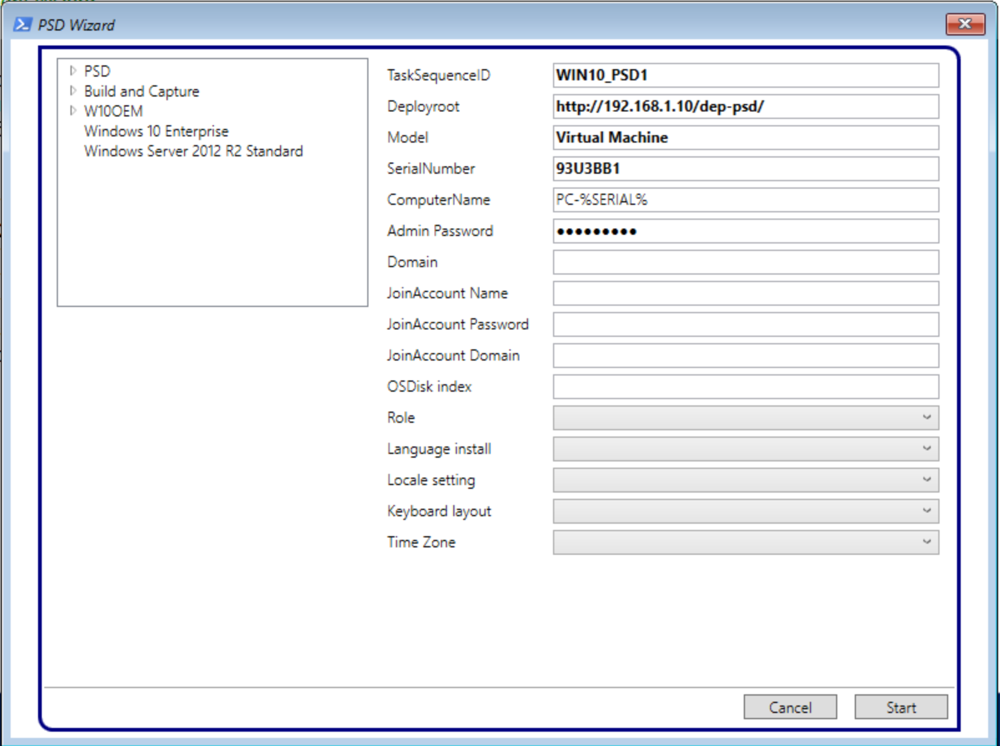
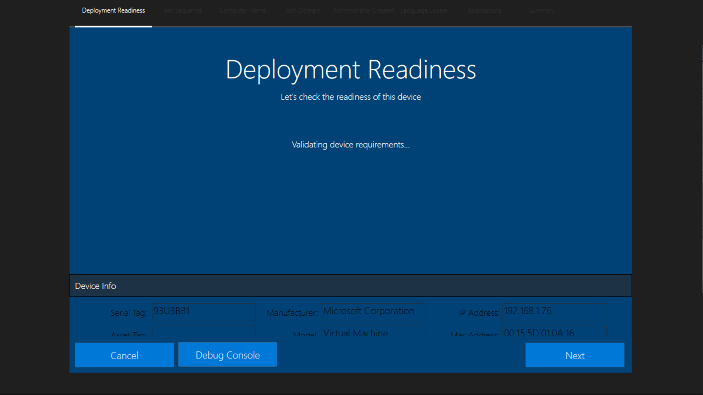
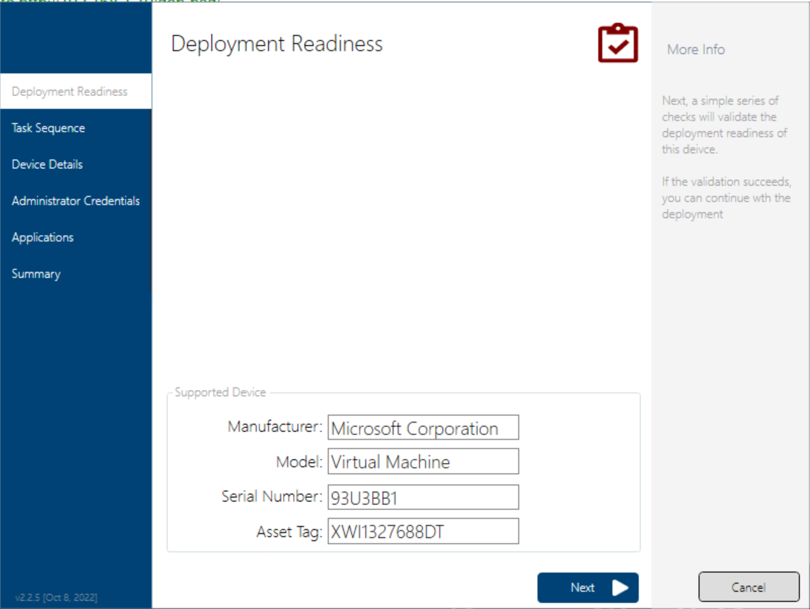
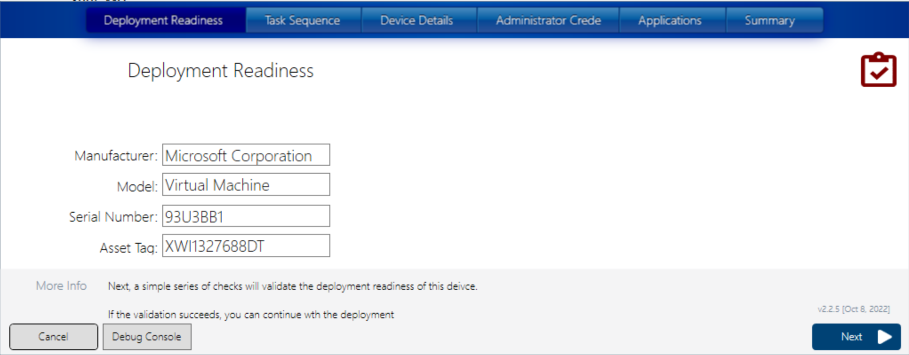
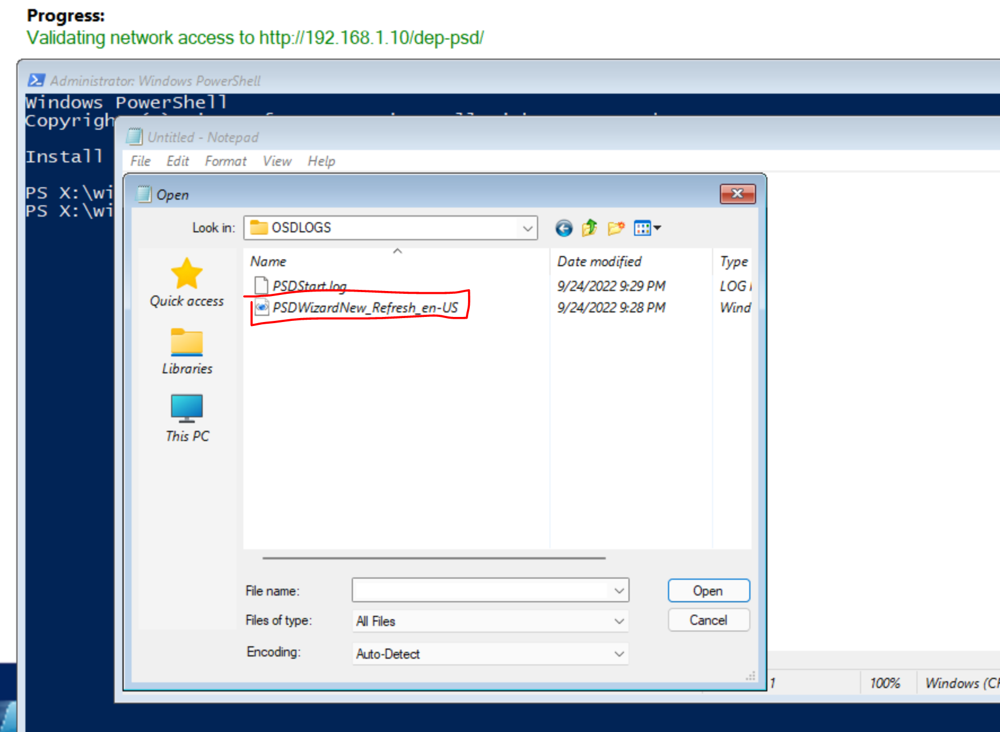
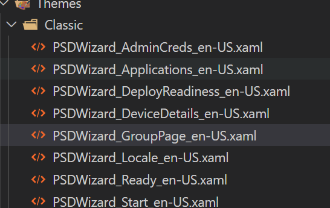
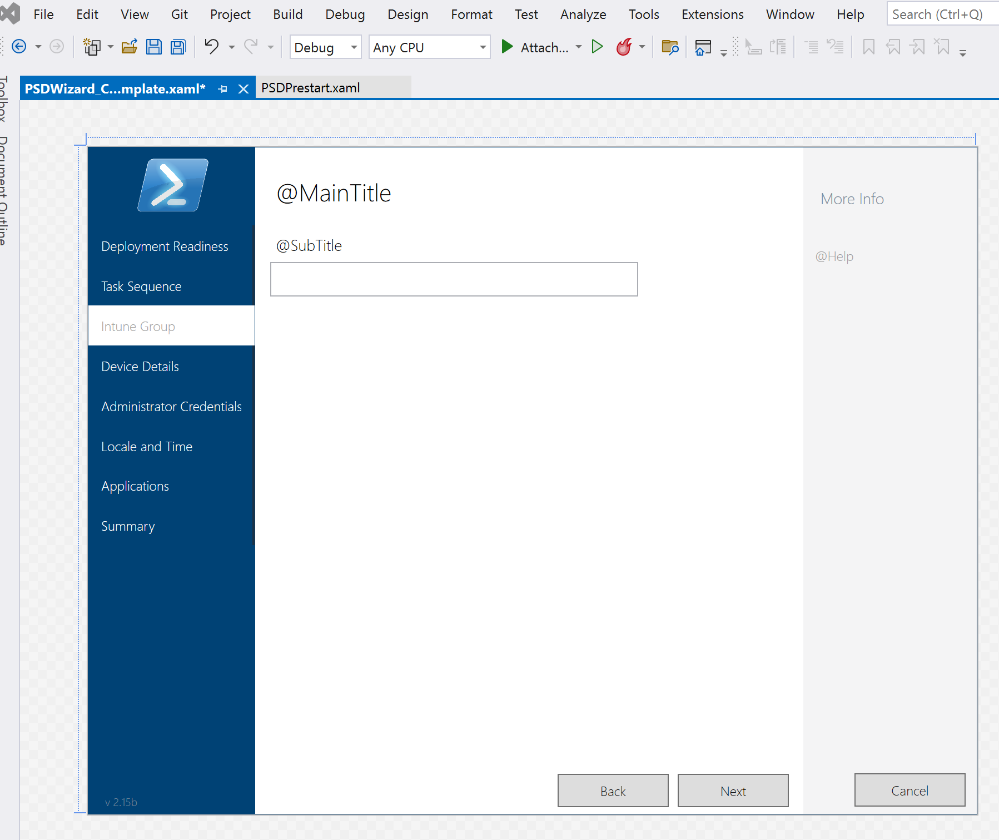
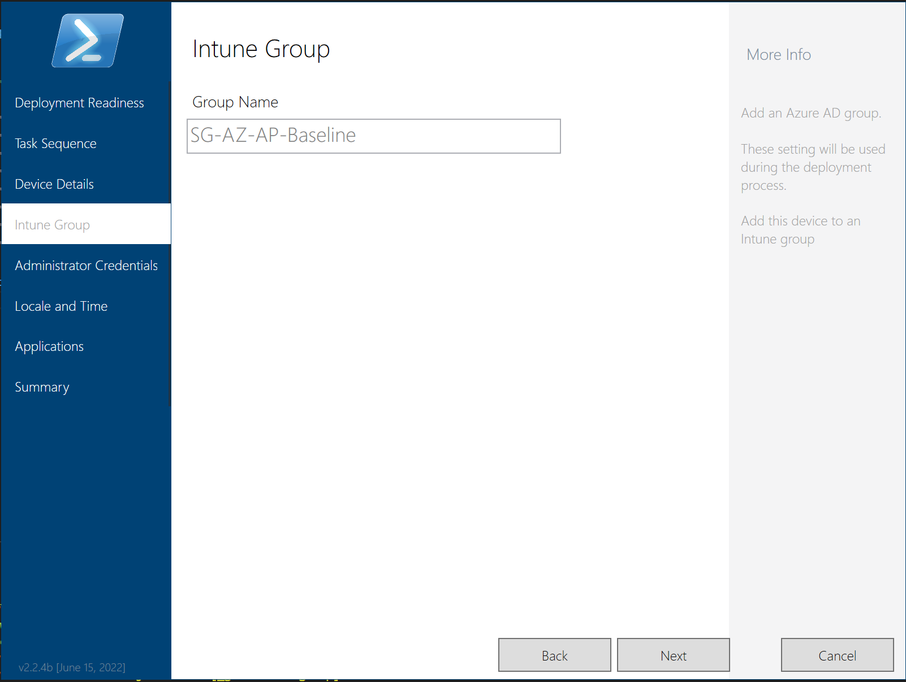

# New PSD Wizard Guide

One of the newer features in PSD is the wizard. The new wizard closely resembles what MDT used to look like with a few other themes available.

## Themes
- Native --> Original theme for PSD (Set _PSDWizard=**Native**_ or leave blank)


- Classic --> Default theme. Looks and feels like MDT original menu (Set _PSDWizard=**PSDWizardNew**_ and _PSDWizardTheme=**Classic**_)


- Modern --> Looks and feels like Windows 10 OOBE (Set _PSDWizard=**PSDWizardNew**_ and _PSDWizardTheme=**Modern**_)


- Refresh --> Looks and feels like MDT original menu but with cleaner input and buttons (Set _PSDWizard=**PSDWizardNew**_ and _PSDWizardTheme=**Refresh**_)


- Tabular --> wider and short height menu. provides a horizontal menu (Set _PSDWizard=**PSDWizardNew**_ and _PSDWizardTheme=**Tabular**_)


## About the wizard

The structure of the wizard was written to be modular as well as include controllable features like the original MDT wizard had. However the wizard is using XAML format instead of HTA (HTML) format. You can read more about it here: [XAML Overview](https://learn.microsoft.com/en-us/windows/uwp/xaml-platform/xaml-overview). 

The wizard also uses the same xml definitions as the original; however there are additional xml files that control the themes, languages, and pages. For further details review the structure section


## The underlying structure

```
DeploymentShare
    |-Tools
        |-Modules
            |-PSDWizardNew
                |--PSDWizardNew.psm1
    |-Scripts
        |--PSDListOfLanguages.xml
        |--PSDListOfTimeZoneIndex.xml
        |-PSDWizardNew
            |--PSDWizard.Initialize.ps1
            |--PSDWizard.Definition_<Language>.xml
            |-Resources
                |--<icons,colors,buttons,etc > in XAML format
            |-Themes
                |--Classic_Theme_Definitions_<Language>.xml
                |--Modern_Theme_Definitions_<Language>.xml
                |--Refresh_Theme_Definitions_<Language>.xml
                |--Tabular_Theme_Definitions_<Language>.xml
                |-Classic
                    |--Classic-<paneid>-<Language>.xaml
                |-Modern
                    |--Modern-<paneid>-<Language>.xaml
                |-Refresh
                    |--Refresh-<paneid>-<Language>.xaml
                |-Tabular
                    |--Tabular-<paneid>-<Language>.xaml
                
```
> Keep in mind only **en-US** is supported right now, but has potential to use additional.


## File explanations

 - **PSDWizardNew.psm1** --> the module that is loaded to present the UI. Each page is split into there own respective xaml file. The module will reference the customsettings.ini for any skips, language, and theme variables, compare that with the definition files (eg. PSDWizard.Definition_**en-US**.xml and **Classic**\_Theme_Definitions_**en-US**.xml). Then it will construct all pages into a single UI.
 - **PSDWizard.Initialize.ps1** --> The additional supporting functions to use during the Wizard. This is the script that makes the UI respond to input such as invalid computername or password doesn't match.
 - **PSDListOfLanguages.xml** --> Used in UI to display locale dropdown
 - **PSDListOfTimeZoneIndex.xml** --> Used in UI to display timezone dropdown
 - **\<Resource\>.xaml files** --> These are the variant theme buttons, icons and visual in UI
 - **\<Theme\>_Theme_Definitions_\<Language\>.xml** --> Contains list of pages (_aka Panes_) each theme can use and there id's
 - **\<theme\>-\<paneid\>-\<Language\>.xaml** --> Each page for each theme. Example in the classic theme there is a _PSDWizard_Applications_en-US.xaml_ that is the layout of the applications page in english. 


## Supported variables in _Bootstrap.ini_

- **SkipBDDWelcome** --> YES or NO.  Toggles the Welcome splash screen. 

## Supported variables in _CustomSetting.ini_

- **OSDComputerName** --> even though this is a normal MDT variable the PSD wizard can support some dynamic values. 
    - **_%SERIALNUMBER%"_** --> replaced with serial number of device 
    - **_%SERIAL%_** --> replaced with serial number of device 
    - **_%SERIAL:\<NUM\>%_** --> replaced with last **num**bers of serial number  (eg %SERIAL:7%)
    - **_%\<NUM\>:SERIAL%_** --> replaced with first **num**bers of serial number  (eg %7:SERIAL%)
    - **_%RAND:\<NUM\>%_** -> replaced with alpha numberic character of **num**bers (eg. %RAND:7&)

- **SkipBDDWelcome**--> YES or NO. Toggles the Welcome splash screen. 
- **SkipWelcome** --> YES or NO. Toggles the Welcome splash screen (same as _SkipBDDWelcome_)
- **SkipTaskSequence** --> YES or NO. Toggles the Task sequence page
- **SkipDomainMembership** --> YES or NO. Toggles the Computer name section in device details page 
- **SkipComputerName** --> YES or NO. Toggles the Computer name section in device details page 
- **DeploymentType** --> ONLY SUPPORTS NEWDEPLOYMENT
- **SkipAdminPassword** --> YES or NO. Toggles the admin password section in admin page
- **SkipLocaleSelection** --> YES or NO. Toggles Language section in the locale page. 
- **SkipTimeZone** --> YES or NO. Toggles the Timezone section in the locale page. 
- **SkipApplications** --> YES or NO. Toggles the Application page (see known issue)
- **SkipSummary** --> YES or NO. Toggles the summary page (Shows what was selected in UI)
       

> The main PSD variable definitions do not include the listed items below; they will need to be added to the Property section in the customsettings.ini

- **SkipPSDWelcome** --> YES or NO. Toggles the Welcome splash screen. 
- **PSDWizard** --> Native or PSDWizardNew. Native is the original wizard (not new)
- **PSDWizardTheme** --> Classic, Modern, Refresh, Tabular (see theme section for details and screenshots)
- **SkipDeployReadiness** --> YES or NO. Toggles the deployment readiness page (first page after welceome wizard). This page isn't very useful yet. 
- **PSDWizardLogo** --> Adds logo to top left corner of wizard and on Welcome page. (eg. PSDWizardLogo=%SCRIPTROOT%\powershell.png)
- **PSDDebug** --> YES or NO. Will activate the Debug Mode and constructed UI will be exported with logs



# Keyboard shortcuts

- **Escape** will make the menu not on top (allows other screens to go in front)
- **Space bar** will close the PSD Welcome Wizard (if enabled)
- **Tab** will navigate menu forward
- **Shift Tab** will navigate menu reverse
- **F5** will refresh Task sequence list
- **F9** minimizes the wizard

## Additional Language support (TEST ONLY - NOT SUPPORTED)
 Currently the PSD only supports english (en-US). However if you are multilingual and want to test additional languages here are the steps to do it.

1. Edit the PSDStart.ps1 line: 669 from:

```powershell
$result = Show-PSDWizard "$scripts\PSDWizard.xaml"
```
To
```powershell
$result = Show-PSDWizard "$scripts\PSDWizard.xaml" -Language $tsenv:Language
```

2. Edit Customsettings.ini to match language locale (eg en-ES)
```ini
Language=en-ES
```
...and make sure your setting the CustomSAetting.ini values to match the theme (see themes section)

3. Make a copy of each page and definition files and rename to reflect new language (using **en-ES** as an example)
```
DeploymentShare
    |-Scripts
        |-PSDWizardNew
            |--PSDWizard.Definition_en-ES.xml
            |-Themes
                |--Classic_Theme_Definitions_en-ES.xml
                |-Classic
                    |--PSDWizard_AdminCreds_en-ES.xml
                    |--PSDWizard_Applications_en-ES.xml
                    |--PSDWizard_DeployReadiness_en-ES.xml
                    |--PSDWizard_DeviceDetails_en-ES.xml
                    |--PSDWizard_Locale_en-ES.xml
                    |--PSDWizard_Ready_en-ES.xml
                    |--PSDWizard_Start_en-ES.xml
                    |--PSDWizard_TaskSequence_en-ES.xml
                    |--PSDWizard_Template_Classic_en-ES.xml

```

4. Edit each file.
    - Edit the Wizard definition's xml file. Change the quoted values for _MainTitle_ element, _Subtitle_ element, and _title_ attribute value (DO NOT CHANGE **ID** or ANYTHING ELSE)
        - Be sure keep it in this format
        ```xml
            <![CDATA[" you language text "]]>
        ```
    - Edit the theme definition's references values to point to new language pages (DO NOT CHANGE **ID**)
    - Edit each page within theme folder editing values for Content (DO NOT CHANGE **XNAME** or ANYTHING ELSE)

5. Provide Feedback to [@powershellcrack](https://github.com/PowerShellCrack) or team


# Custom Pages

It is possible to add (or remove pages) to the PSD Wizard. Sine there is not UDI wizard (...yet); this is a manual process. 

### Here are the steps

1. Open the definition file for a theme (eg. <PSD>\Script\PSDWizardNew\Themes\Classic_Theme_Definitions_en-US.xml) in a Text editor
2. Add a new pane line with page details (eg. <Pane id="GroupPage" reference="Classic\PSDWizard_GroupPage_en-US.xaml" margin="0,0,0,0" />). Order DOES matter.


3. Add a new xaml file in the <themes> folder and name it the same as the reference. In this example I would add a new file here:  <PSD>\Script\PSDWizardNew\Themes\Classic\PSDWizard_GroupPage_en-US.xaml. 



4. Edit the page. It must consist of these elements (expect what's in bold). Be sure give the name of the tab something unique (eg. x:Name="_grpTabLayout")

```xml
<Grid x:Name="_grpTabLayout" Margin="0" Grid.ColumnSpan="2">
    <Grid.ColumnDefinitions>
        <ColumnDefinition Width="490"></ColumnDefinition>
        <ColumnDefinition Width="150"></ColumnDefinition>
    </Grid.ColumnDefinitions>
    <Label x:Name="_grpTabMainTitle" Grid.Column="0" HorizontalAlignment="Left" Margin="10,20,0,0" VerticalAlignment="Top" FontSize="22" Content="@MainTitle"/>
    <Label x:Name="_grpTabSubTitle" FontSize="14" HorizontalAlignment="Left" Margin="10,73,0,0" VerticalAlignment="Top" Content="@SubTitle"/>
 
    <TextBox x:Name="TS_IntuneGroup" HorizontalAlignment="Left" Height="31" Margin="10,103,0,0" VerticalAlignment="Top" Width="331" Foreground='Gray' FontSize="18"/> 

    <Label Content="More Info" Grid.Column="1" FontSize="14" HorizontalAlignment="Left" Margin="10,31,0,0" VerticalAlignment="Top" Foreground="LightSlateGray" />
    <TextBlock x:Name="_grpTabMoreInfo" Grid.Column="1" HorizontalAlignment="Left" Margin="10,89,0,0" Width="136" TextWrapping="Wrap" VerticalAlignment="Top" Height="422">
        <Run Text="@Help"/>
    </TextBlock>
</Grid>
```


5. Within the grid you can add code to make inputs, dropdowns, buttons, etc. The problem is this code HAS to be formatted correctly or the whole wizard won't load! I like to take code from other pages as an example. If you do this any x:Name MUST be unique and by setting one of the x:Name with a TS_<value>; will be exported as a variable when wizard is closed.

> HINT: Knowing the margins can be tricky; either use Visual Studio Community to edit the xaml or copy code from another page of the same property. I copied the search input box from the application page and removed some properties. In this screenshot there is a section to build a two column page (help menu is in Column 1)


Here is what it looks like in VS2022



> The last thing to do is control how the page will display and what language. You'll notice in the VS2020 Screenshot, some text with @ in the. These are placeholders for words in a language. Even though English is the only supported language right now, this definition contains all types of pages and their conditions. 

6. Open the main language definition file (eg. <PSD>\Script\PSDWizardNew\PSDWizard_Definitions_en-US.xml) in a Text editor
Add a new Pane to where you want the pane to show up (order does matter here). The id must match the name designator of the page (eg. GroupPage is the designator for PSDWizard_GroupPage_en-US.xaml) 

```xml
<Pane id="GroupPage" title="Intune Group">
	<Condition><![CDATA[ UCase(Property("SkipGroupPage")) <> "YES"]]></Condition>
	<MainTitle><![CDATA[ "Intune Group" ]]></MainTitle>
	<SubTitle><![CDATA[ "Group Name" ]]></SubTitle>
	<Help><![CDATA[ "Add an Azure AD group.&#xa;&#xa;These setting will be used during the deployment process.
	&#xa;&#xa;Add this device to an Intune group" ]]></Help>
</Pane>
```


> Optional: You can fill in the conditions, Main title, subtitle and help with what you want. 
If done correctly you should get this:



and at the ready pages, it will show up:


## CHANGELOG

The changelog can be found here: [CHANGELOG.MD](..\Scripts\PSDWizardNew\CHANGELOG.md)

## Future releases / in-development

- Use runspace for multithreading, refesh capability, and faster response
- Support application profiles
- Support profile selections
- Support Autopilot Tasksequence
- Provide deployment readiness checks
- Support additional languages
- Cleanup Windows 10 OOBE theme
- Additional themes
    - Star Wars theme
    - Windows 11 OOBE theme
    - Tabular with circular buttons theme (for touch screens)
    - Teams like theme

# Known issues

- Applications that have not ben toggled as disabled then reenabled, will not show in UI. Workaround is to use * in search.
- _SkipApplications=NO_ must exist in CustomSettings.ini if you want the application page to show